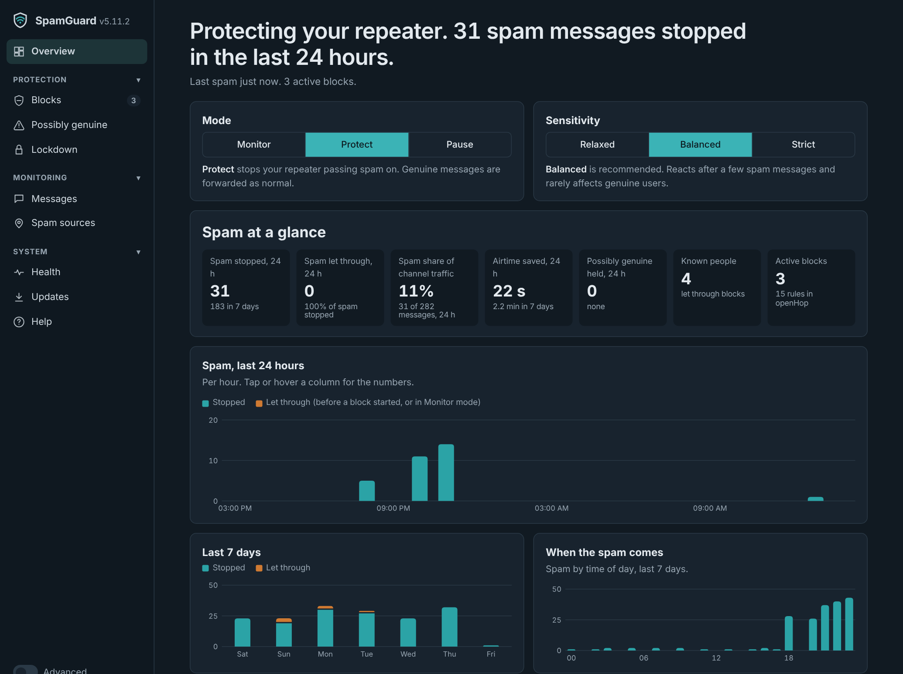

# openHop SpamGuard

Spam protection for an [openHop](https://docs.openhop.dev/) MeshCore repeater. SpamGuard runs on the same Pi as openHop, watches the channel messages your repeater hears, and when it spots spam it writes openHop policy rules so your repeater stops passing it on. It works offline; the only thing that ever goes to the internet is the optional once-a-day check for a new version.

- Spots spam campaigns: the same text under rotating made-up names, copies with words added, look-alike letters, hidden characters and emoji tricks.
- Blocks by text, by the repeater the spam enters through, and by route when the spammer's repeater keeps changing its ID.
- Stops duplicate floods: the first copy of a message gets through, copies under other names don't.
- Learns who the regulars are, so a blocked spam repeater still passes their messages, links from strangers can be held during an attack, and a Lockdown button lets only known people through for a while.
- A web page with a simple view and an Advanced view, where every setting explains its side-effects.
- Monitor mode to try it safely, an evidence log with a replay tool for tuning, and a Health panel with self-repair.
- Updates from GitHub when **you** press Update. Nothing installs by itself.




_Example data: names and numbers are made up._

## Requirements

- openHop Repeater installed **natively** on a Raspberry Pi or other Debian-style Linux (not the Docker install). New to openHop? See [docs/openhop-fresh-install.md](docs/openhop-fresh-install.md).
- An openHop API token: openHop dashboard > System > Configuration > Access > API Tokens.
- systemd, and `curl` for updates (both standard on Raspberry Pi OS).

Tested on Raspberry Pi OS (32-bit, Pi 3) in daily use, and with a full openHop + SpamGuard install on Ubuntu 24.04 (x86_64). Python 3.10 to 3.13.

## Install

On the Pi:

```
git clone https://github.com/flackrat/openhop-spamguard.git
cd openhop-spamguard
sudo bash install.sh
```

The installer asks two questions about openHop's speed (see [openHop running behind](#openhop-running-behind-speed-fix)); answer **y** to both. Then put your API token in the config and start SpamGuard:

```
sudo sed -i 's/PASTE_OPENHOP_API_TOKEN_HERE/YOUR_TOKEN/' /etc/openhop_spamguard/config.yaml
sudo systemctl start openhop-spamguard
```

Open `http://<your-pi>:8091/`. Start in **Monitor** for a day: messages it would have stopped are marked "Would be stopped". When you're happy, switch to **Protect**.

The full step-by-step guide, with everyday commands and troubleshooting, is in [docs/install-and-troubleshooting.md](docs/install-and-troubleshooting.md).

## Updating

SpamGuard looks for a new release once a day (you can turn that off in Advanced > Updates) and shows it in the **Updates** section of its page, with what's new. It only installs when you press **Update**. Your settings, blocks and learnt routes are kept, and if the new version doesn't start, the previous one is put back automatically.

From the command line instead:

```
sudo bash /opt/openhop_spamguard/update.sh --check          # installed and latest versions
sudo bash /opt/openhop_spamguard/update.sh                  # install the latest release
sudo bash /opt/openhop_spamguard/update.sh --version v5.8   # install a particular release (also to go back)
```

Or, from your clone: `git pull && sudo bash install.sh`.

How the button works: SpamGuard runs as an ordinary user, so it can't install software. Pressing Update leaves a request file that a small root-owned systemd service (`openhop-spamguard-update`) carries out. It only ever downloads tagged releases of this repository over HTTPS. Changes are listed in [CHANGELOG.md](CHANGELOG.md).

## Uninstall

```
sudo bash /opt/openhop_spamguard/uninstall.sh
```

This stops SpamGuard, takes its blocking rules (names starting `spamguard:`) back out of openHop, and removes its program, config, data and services. openHop, its settings and any rules you made yourself are left alone.

- `--keep-evidence` keeps the evidence log in `/var/lib/openhop_spamguard/evidence`.
- `--undo-speed-fix` also puts openHop's original packet-count setting back. Otherwise the speed fix stays, as it only makes openHop faster.
- If you chose 7 days of packet history at install, openHop keeps that. To go back to its default, set `sqlite_cleanup_days: 31` in `/etc/openhop_repeater/config.yaml` and restart openHop.

On versions before 5.8.3, which don't have `uninstall.sh`, run it from a fresh download:

```
git clone https://github.com/flackrat/openhop-spamguard.git /tmp/sg && sudo bash /tmp/sg/uninstall.sh
```

## The web page

- **Simple view**: what's happening, the mode (Monitor / Protect / Pause), the sensitivity (Relaxed / Balanced / Strict), what's blocked, and recent messages with "This is spam" and "Not spam" buttons.
- **Advanced** (switch at the top right): every setting with what it does and a "Watch out" note on its side-effects, per-block controls, per-repeater statistics, spam campaigns, exceptions (trusted senders, repeaters, texts, channels) and an activity log.

## How the spammer might try to get round it, and what SpamGuard does

| Workaround | Countermeasure |
|---|---|
| New name every message | Names are scored for looking made-up; many new names through one repeater also triggers a block |
| Lowercase or longer random names | Name scoring ignores case and length; "word + number" names like Dave1985 stay human |
| Realistic names (Dave, Sarah...) | "Brand-new names" limit per repeater |
| Random words added to the message | Similar messages are grouped; the rule matches the shared part |
| Look-alike letters, hidden characters, l33t | Text is normalised before comparing; these tricks are themselves a spam sign; each variant is blocked |
| Posting slowly to stay under limits | A 2-hour long window catches slow spam |
| Replies to the same person (@[name]) looking alike | Mentions are ignored when comparing messages, so ordinary replies are never treated as a campaign; a campaign also needs at least two made-up, disguised or brand-new names |
| Bringing the same spam back hours or days later | Text blocks for campaigns sent under made-up names stay in openHop for 7 days (Advanced > Timing), so a returning text is stopped from its first copy |
| A troll posting abuse under the same name each time | Block the sender by name (Advanced, or **Block sender** on the message); that name is then never trusted or known |
| Copying a trusted or known person's name | Gets past repeater, link and lockdown blocks (they let known names through), but never campaign or text blocks; a trusted name from a new place is logged |
| Moving location / new routes | Repeater blocks match anything passing through, so a new route from the same repeater is caught at once; known people are let through. Text rules work from anywhere |
| Posting links from a fresh name each time | While a campaign is under way, links from names SpamGuard doesn't know are held |
| Within direct range (no repeaters) | Warning on the page; text rules and duplicate suppression still work |
| 2- or 3-byte path hashes | Routes are matched at any width; exceptions cover all widths |
| Moving to a hashtag channel | Add the channel by name; its key is worked out automatically |
| Flooding to exhaust rules | Rule cap with the oldest duplicate rules dropped first; repeater blocks are kept |
| Faking routes to frame a genuine repeater | Exact-route blocking only affects the faked route; mark your neighbours "Never block" |
| Emoji added to a random name (UD6DWREK🔥) | Names are scored with emoji removed; emoji in genuine names (Ohm🔌) don't count against them |
| Emoji sprinkled between words, different each time | Messages are compared with emoji removed; a rule requiring all the shared words catches new arrangements |
| Emoji inside words (Bu🔥ilt), invisible tag letters | Flagged as disguised text, which counts as a spam sign; normal emoji use (👍, family emoji, flags) isn't |
| Emoji-only spam, with skin-tone or colour variants | Compared by base emoji, so 💩 and 💩🏽 count as the same message |
| Repeater firmware that changes its ID, so the first hop changes every time | SpamGuard learns which repeaters normally start routes and which relay. When several never-seen first repeaters send spam through the same onward route (e.g. >B1>7E), unknown ones on that route are blocked while known ones are let through. A trusted sender arriving via a new repeater gets it let through automatically, and you can allow any repeater from the page |

## Known people, links and Lockdown

SpamGuard keeps a list of names it has seen sending genuine messages (not made-up looking, not part of a spam campaign, and not arriving through a blocked repeater). It writes the list into openHop as a policy object, `@spamguard.known_senders`, with one "let known people through" rule per channel, placed after your own rules. Three kinds of block sit below that rule, so they never stop a known name:

- **Repeater blocks** now block *anything passing through* the spam repeater, except known people. In testing on real logs the spammer's messages took a different full route every time, so blocking learnt routes one by one never caught them; this catches every one. The older "Routes starting there" and "Anything passing through" choices are still in Advanced.
- **Links from names it doesn't know** (http or www.) are held while a spam campaign is under way, by default for an hour after the last campaign activity. Advanced > Known people can make this always or never.
- **Lockdown** (button on the page): for 30 minutes to 2 hours, only known names get through on the channels SpamGuard reads. New people are held too, so it's for heavy attacks only. It ends by itself.

Replaying a day of real traffic (69 spam, 597 genuine messages): spam caught went from 58 to 65. 4 genuine messages were held: two first-time posts (a link, and a message through the spam repeater) and two from names that looked like the spammer's own joke accounts.

Things to know:

- A name counts as known after 1 genuine message by default (Advanced > Known people). Names can be faked, so a spammer who copies a regular's exact name gets past these three blocks. Text and campaign blocks still apply to everyone.
- After updating, SpamGuard starts the list from the names it heard in the last day.
- Names are forgotten after 30 days of silence. The list is in openHop's `policy.yaml`; channel names are public anyway, but bear it in mind if you share that file.

## Health and self-repair

The **Health** panel on the page shows whether SpamGuard is working: how long it has been running, when it last checked, whether openHop is answering, whether all its rules are in place in openHop, and how many times it has restarted. Advanced adds the Pi's temperature, memory, disk and load.

SpamGuard looks after itself:
- **Restarts if it hangs.** It checks in with systemd after every pass of its checking loop. If it stops checking in for 90 seconds, systemd restarts it. It also restarts after a crash, and never gives up.
- **Puts its rules back.** Once a minute it confirms openHop still has exactly its rules (after an openHop restart, restore or manual edit), and restores them if not. Your own rules are never touched.
- **Keeps protecting while down.** Its rules live in openHop, so blocking carries on even if SpamGuard is stopped. Blocks just don't expire or update until it's back.
- **Measures openHop's delay.** It shows how far behind real time openHop's packet list is, and warns when it is 30 seconds or more behind, because spam copies arriving in that gap get through before a block starts. Each evidence-log line also records how late SpamGuard saw the message.
- **Notices a deaf radio.** If openHop reports no new packets of any kind for 20 minutes, the Health panel warns that its radio may have stopped receiving.
- **Asks openHop for as little as possible.** It reads only packets newer than the last ones it saw, using a query openHop's database answers from its time index (older openHop versions fall back to the recent packet list).
- **Stays out of the repeater's way.** It runs at lower CPU priority than openHop and is capped at 400 MB of memory.

Quick checks from the command line:
```
systemctl is-active openhop-spamguard          # "active" = running
curl -s http://127.0.0.1:8091/health           # "state": "ok" / "warn" / "bad"
systemctl show openhop-spamguard -p NRestarts  # how many times systemd has restarted it
```
`/health` returns HTTP 200 when healthy and 503 when something is wrong, so it can be watched by a monitoring tool such as Uptime Kuma.

## openHop running behind (speed fix)

On a small Pi with a large packet database, openHop can fall minutes behind saving packets. SpamGuard then sees spam late, and a wave gets through before a block starts. The Health panel shows this as **openHop delay**.

The cause is in openHop. Every time it saves a packet it recounts every packet it has stored, and keeps the answer for only 3 seconds. That count is only used for the graphs, which are written once a minute. `tune-openhop.sh` changes that 3 seconds to 60 seconds, which changes nothing you can see, and offers to keep 7 days of packet history instead of 31.

```
sudo bash /opt/openhop_spamguard/tune-openhop.sh            # apply (asks first)
sudo bash /opt/openhop_spamguard/tune-openhop.sh --check    # report only
sudo bash /opt/openhop_spamguard/tune-openhop.sh --undo     # put openHop's value back
```

An openHop upgrade puts the old value back. The Health panel then says "openHop's speed fix isn't in place"; run the script again.

## Evidence log and replay

Switch on **Keep an evidence log** in Advanced > Detection settings. SpamGuard then writes one line per channel message to `/var/lib/openhop_spamguard/evidence/` (one file per day, kept 7 days by default). Each line records the route, sender, text, every spam signal, which rule caught it, and your **This is spam** / **Not spam** answers. Block changes and settings are recorded too. A restart never writes the same message into the log twice.

Download it from Advanced > Evidence log. **Names scrambled** replaces every name and @mention with a code (keeping its spam score and shape), so it can be shared safely.

Replay a log with different settings to see what would have been caught, missed or wrongly blocked:
```
/opt/openhop_repeater/venv/bin/python /opt/openhop_spamguard/replay.py spamguard-evidence.jsonl --details
/opt/openhop_repeater/venv/bin/python /opt/openhop_spamguard/replay.py spamguard-evidence.jsonl --set dedupe_seconds=600
```
The more messages you label with the two buttons, the more useful the replay report is.

## Notes on rotating-identity protection

- It needs history: SpamGuard learns normal routes as it runs (kept for 7 days by default). Right after installing, few repeaters are "known", so a rotation block may also hold back a genuine new repeater on that route until you allow it.
- It only triggers on strong spam signs (made-up names, disguised text or campaign copies), never on ordinary traffic from new repeaters.
- Its rules are placed after your own openHop rules, so its "let through" exceptions never override anything you set up.
- openHop can't match "exactly this route after an unknown first repeater", so the block matches any route of the same length containing those repeaters. Routes with the same repeaters in a different order are rare, but would also be held back.

## Limits

SpamGuard only controls what **your** repeater forwards. People within range of the spammer will still hear him, so the more repeaters near the source that filter, the better. It can't read private channels or direct messages unless you add the channel key.

## Licence

MIT, see [LICENSE](LICENSE).

## Disclaimer

- **No warranty.** SpamGuard is provided "as is", without warranty of any kind, express or implied. To the extent permitted by law, the author and contributors accept no liability for any loss or damage arising from its use, including missed spam, genuine messages being blocked, repeater downtime or data loss. See the MIT licence for the full terms. Nothing in this disclaimer limits any liability that cannot be limited by law.
- **You run it, you decide.** SpamGuard changes what your own repeater forwards. You choose its mode and settings and you are responsible for how you operate your repeater. Start in Monitor mode and check what it would block.
- **Radio rules.** SpamGuard doesn't transmit or change radio settings, but the repeater it runs alongside must be operated within the rules for your country and band (in the UK, Ofcom's licence-exempt short-range device rules). That is the operator's responsibility.
- **Personal data.** SpamGuard reads Public and hashtag channel messages your repeater receives, which anyone with a MeshCore device can read. It keeps recent messages, sender names and routes in memory and, only if you switch the evidence log on, in files on your own Pi (7 days by default). Nothing is sent anywhere except the optional once-a-day version check to GitHub. If you keep or share logs, you are responsible for complying with data-protection law where you are (for example the UK GDPR); use the "names scrambled" export when sharing.
- **Changes to openHop.** The optional `tune-openhop.sh` edits one setting inside your openHop installation, with your consent and a backup. Use it at your own risk; it can be undone with `--undo`.
- **Independent project.** SpamGuard is not affiliated with, endorsed by or supported by openHop, MeshCore or their developers. Product names are used only to describe compatibility and belong to their respective owners.
- **Not professional advice.** The documentation describes how the author set things up; it isn't legal, regulatory or professional advice.
